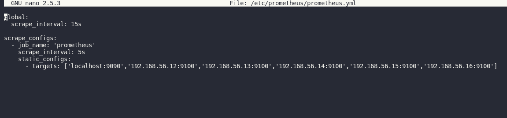

# Terraform-Vagrant-Ansible
The project assumption was to get to know better tools such as Ansible, Vagrant, Grafana and Prometheus. I was trying to imitate the professional work environment. While creating this project the most important for me were automating work as it is possible and constant monitoring of my resources.   

Tools which I have used:  
<b>1.Vagrant and Virtual Box</b> - I have installed the VB then I have created six virtual machines using Vagrant. My Vagrantfile contains information about: 
-The name of the VM. 
-VM image (Ubuntu). 
-The network card configuration. I have to set the appropriate IP address, network mode and turn on the second adapter in "Host-only Adapter" mode.  

<b>2. Ansible</b> - One of my project concepts was to introduce elements of Provisioning such as IaC tools. I have decided to use Ansible and Vagrant. I have created two Ansible playbooks and a custom inventory file. I have classified hosts into two groups. It allows me to decide on which group of hosts I am executing playbook.   

<b>3.Prometheus and Grafana</b> - The next step was a configuration Prometheus and Grafana.   
Prometheus server scrapes and stores metrics from my machines. Every machine is running Node Exporter which exposes metrics. I have configured Prometheus to scrape this data. For this, I have modified the prometheus.yml as in the picture below.  

  
Grafana is responsible for displaying metrics stored in my Prometheus server. I have configured Grafana to access the Prometheus server as a data source. Then I have created a Grafana dashboard which allows me to see statistics from a particular host.   

